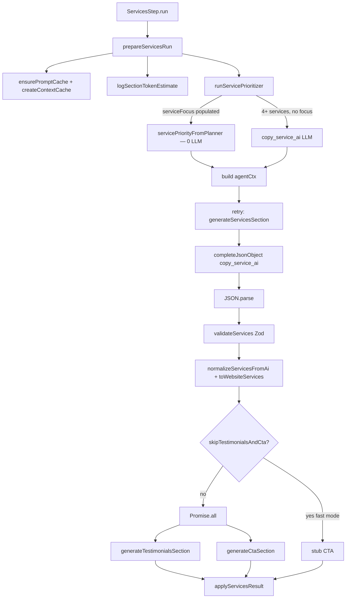

# Sprint D2.5 — Services Stage Bottleneck Investigation

**Date:** 2026-07-23  
**Scope:** Analysis only — no production code changes  
**Data sources:**
- 10-site alpha batch: `scripts/internal-alpha/output/*.json` (roofing matrix, `balanced` mode)
- Aggregated telemetry: `scripts/internal-alpha/output/REPORT.md` §11
- Code: `src/lib/ai/orchestrator/steps/services.step.ts`, `src/lib/ai/retry/retryServices.ts`, `src/lib/ai-engine/content-generator.ts`, `src/lib/ai-engine/service-prioritizer.ts`

**Goal:** Reduce Services stage latency from ~45 s to <20 s without reducing content quality.

---

## Executive summary

The Services pipeline step averages **44.8 s** across 10 alpha sites and is the **dominant bottleneck** of the parallel content wave (hero / about / services / faq). It accounts for **~47% of total site wall-clock** (~95 s avg).

**Root cause:** Three LLM round-trips are arranged in a **sequential chain**, even though two of them (testimonials, CTA) do not consume services output:

```
prioritizer (skipped) → services LLM (~30 s) → testimonials ∥ CTA (~14.5 s wall)
                      ────────────────────────────────────────────────────────
                      total ≈ 44.7 s
```

Services completion output is **~457 tokens** (p50) — far below the 2 000-token concern threshold. Latency is **model round-trip bound**, not output-volume bound. The configured `maxCompletionTokens: 4096` on services generation is headroom, not observed usage.

**Highest-impact, lowest-risk fix:** Run `generateServicesSection`, `generateTestimonialsSection`, and `generateCtaSection` in a **single `Promise.all`** after prioritizer setup. Estimated savings **~14–15 s** (44.8 → ~30 s) with zero schema change and no content-quality trade-off, because testimonials/CTA already use only `agentCtx` + `stubHero()`.

**Path to <20 s:** Parallelize the three calls **plus** prompt slimming (~4 s) and/or route the services call to a faster model tier (~6–10 s). A complementary stack projects **~25–27 s total savings** (44.8 → **~17–20 s**). Merging all three sections into one JSON completion is feasible but offers smaller incremental gain once parallelized.

**Note vs Sprint D1:** The D1 single-site report showed a Service Prioritizer LLM call (~12 s). Current code **skips the prioritizer** whenever `meta.brief.serviceFocus` is populated — which is always true for matrix inputs because `briefFromDna()` parses `input.services` into `serviceFocus`. The 10-site batch confirms **zero prioritizer LLM rows** under `parentStep=services`.

---

## Current architecture

### Pipeline placement

Services runs as one orchestrator step inside the **parallel content wave** (alongside hero, about, faq). Wall-clock for the wave equals **max(step durations)**; services is always the longest fork.

Entry point:

```15:19:src/lib/ai/orchestrator/steps/services.step.ts
  async run(ctx: PipelineContext): Promise<PipelineContext> {
    const run = prepareServicesRun(ctx);
    const result = await retryServices(run);
    return applyServicesResult(run.pipeline, result);
  }
```

### Internal flow (retryServices)



### Sequential vs parallel LLM calls

| Phase | Execution | Depends on services output? |
| --- | --- | --- |
| Service Prioritizer | Sequential (first) | No — uses raw input + brief |
| Services generator | Sequential (second) | No — uses prioritizer plan only |
| Testimonials | Parallel with CTA (third) | **No** — uses `agentCtx` only |
| CTA | Parallel with testimonials (third) | **No** — uses `agentCtx` + `stubHero()` |

**Key finding:** Testimonials and CTA are **artificially gated** after services validation despite having no data dependency on generated service cards. They could start concurrently with the services LLM call.

---

## Timing breakdown

Telemetry records LLM sub-stages via `completeJsonObject` → `recordStageTelemetry`. **Prompt assembly, Zod validation, and post-processing are not separately instrumented** — they are embedded in the retry attempt wall-clock (negligible when retries = 0).

### Per-sub-phase table (10-site alpha, n=10)

| Sub-phase | Source | Avg (ms) | Min | Max | p50 | Notes |
| --- | --- | ---: | ---: | ---: | ---: | --- |
| **Prompt assembly** | *Inferred* | **< 5** | — | — | — | `prepareServicesRun` + cache hit (`prompt_cache` row = 0 ms) |
| **Service Prioritizer LLM** | Telemetry | **0** | 0 | 0 | 0 | Skipped — `brief.serviceFocus` always populated from input |
| **Services LLM request** | `copy_service_ai` parent=services | **30 229** | 24 666 | 36 699 | 29 426 | 67% of step time |
| **JSON validation** | *Inferred* | **< 100** | — | — | — | Zod inside `retry()`; 0 retries across batch |
| **Post-processing** | *Inferred* | **< 50** | — | — | — | `normalizeServicesFromAi`, `toWebsiteServices`, padding |
| **Testimonials LLM** | `copy_testimonials_ai` | **12 985** | 6 509 | 24 734 | 15 728 | Runs after services gen |
| **CTA LLM** | `copy_cta_ai` | **14 517** | 7 946 | 26 363 | 17 017 | Runs after services gen; **sets parallel-tail wall** |
| **Parallel tail wall** | max(testimonials, cta) | **14 517** | 7 946 | 26 363 | 17 017 | 32% of step time |
| **Services step total** | `usage.steps[step=services]` | **44 754** | 35 944 | 51 460 | 44 061 | Matches svc LLM + parallel tail |

**Accounting check:** avg services LLM (30 229) + avg parallel tail (14 517) = **44 746 ms** ≈ reported step total (44 754 ms). ✓

### Instrumentation gaps

| Gap | Impact | Mitigation used in this report |
| --- | --- | --- |
| No timer around `servicesUser()` / prompt string build | Cannot split “prompt assembly” from LLM | Cache-hit row + code review → < 5 ms |
| Validation bundled in `retry()` attempt duration | Cannot isolate Zod ms | 0 retries in batch; Zod on ~4 services is trivial |
| No timer on `normalizeServicesFromAi` | Cannot isolate post-process | Pure sync transforms; < 50 ms estimated |
| Prioritizer skip is silent (no telemetry row) | Skip vs LLM not visible in telemetry | Confirmed via 1 `copy_service_ai` row per site under services |

---

## LLM call inventory

All stages resolve to **`gpt-5-mini`** via `resolveModelForStage()` (no nano routing active in batch).

### Calls inside Services step (parentStep = `services`)

| Stage | Sequential / Parallel | Runs (batch) | Avg latency (ms) | Avg input tok | Avg output tok | Avg cost |
| --- | --- | ---: | ---: | ---: | ---: | ---: |
| `copy_service_ai` (generator) | Sequential phase 1 | 10 | 30 229 | 3 285 | 457 | $0.0017 |
| `copy_testimonials_ai` | Parallel phase 2 | 10 | 12 985 | 1 253 | 214 | $0.0007 |
| `copy_cta_ai` | Parallel phase 2 | 10 | 14 517 | 1 611 | 60 | $0.0005 |
| **Step-attributed total** | — | 10 | **44 754** | **6 149*** | **731*** | **~$0.0030** |

\*Step-level token totals from `usage.steps` aggregate all three calls (6 149 in / 731 out per site for the services step).

### Related calls outside Services step (not in step wall-clock)

| Stage | Parent | Runs | Avg latency (ms) | Notes |
| --- | --- | ---: | ---: | --- |
| `copy_service_ai` | `qa` | 10 | 10 029 | Content-review self-healing regen during QA |

Report §11 shows **20 total `copy_service_ai` runs** = 10 (services generator) + 10 (QA healing). There is **no prioritizer LLM** in this batch.

### Per-site services step durations

| Site | Step (ms) | Services LLM (ms) | Testimonials (ms) | CTA (ms) |
| --- | ---: | ---: | ---: | ---: |
| roofing-dallas | 51 460 | 32 457 | 17 362 | 18 994 |
| roofing-london | 51 043 | 24 666 | 24 734 | 26 363 |
| roofing-toronto | 50 837 | 29 260 | 20 116 | 21 561 |
| roofing-manchester | 44 885 | 36 699 | 6 718 | 8 184 |
| roofing-glasgow | 44 061 | 27 038 | 15 728 | 17 017 |
| roofing-berlin | 43 984 | 25 652 | 16 981 | 18 323 |
| roofing-sydney | 43 965 | 34 782 | 7 577 | 9 175 |
| roofing-austin | 43 233 | 34 312 | 6 820 | 8 903 |
| roofing-miami | 38 129 | 29 426 | 7 308 | 8 699 |
| roofing-bristol | 35 944 | 27 994 | 6 509 | 7 946 |

Retries: **0** on all services-step LLM calls.

---

## Findings

### 1. Services makes multiple sequential LLM phases (yes)

Within one pipeline step there are **up to 4 LLM calls** in the worst case:

1. Service Prioritizer (`copy_service_ai`) — **skipped in alpha batch**
2. Services generator (`copy_service_ai`)
3. Testimonials (`copy_testimonials_ai`) — parallel with #4
4. CTA (`copy_cta_ai`) — parallel with #3

Phases 2 → (3 ∥ 4) are **strictly sequential**. Phase 3 and 4 do **not** read services output.

### 2. Merge strategy for sequential calls

| Strategy | Description | Est. savings | Quality risk |
| --- | --- | ---: | --- |
| **A. Parallelize all three generators** | `Promise.all([services, testimonials, cta])` after prioritizer | **14–15 s** | **Low** — same prompts/models, same isolation inputs |
| **B. Single JSON completion** | Extend services schema: `{ services, testimonials, cta }` | **10–15 s** if replacing sequential chain; **~2–4 s** incremental if already parallelized | **Medium** — larger JSON, higher validation-failure surface, cross-section tone bleed |
| **C. Fast mode skip** | `skipTestimonialsAndCta: true` (`generation-mode.ts`) | **14–15 s** | **Medium** — stub CTA, no demo testimonials |
| **D. Prioritizer skip** | Already active when `serviceFocus` populated | **0 s in batch** | N/A |

**Recommended merge order:** **A first** (parallelize), then evaluate **B** only if still above 20 s target.

Proposed parallel structure:

```typescript
// After prioritizer + agentCtx build:
const [servicesResult, testimonials, cta] = await Promise.all([
  retry(generateServices, validateServices, …),
  generateTestimonialsSection(agentCtx),
  generateCtaSection(agentCtx, stubHero()),
]);
```

On services retry (currently 0% in batch), testimonials/CTA would be wasted — acceptable given `maxRetryRate` target, or gate parallel start on attempt 1 only.

### 3. Can testimonials and CTA live in the same completion as services?

**Yes, technically feasible.**

| Criterion | Assessment |
| --- | --- |
| Schema | All three already return JSON objects; union shape is straightforward |
| Prompt isolation | Each agent today uses disjoint system prompts; merged prompt needs section-specific rules blocks |
| Data deps | None — CTA uses `stubHero()` (available pre-hero-fork result via stub); testimonials use business/plan context only |
| Output size | Combined ≈ 457 + 214 + 60 ≈ **730 completion tokens** — still well under 2 000 |
| Validation | Would need composite Zod schema or partial validation per subsection |
| Quality | Risk of services copy quality drift if model attention splits across three tasks in one completion |

**Verdict:** Same-completion merge is ** feasible** but **parallel three-call** achieves most latency win with lower quality risk. Same-completion is a second-tier option if parallelization alone misses <20 s.

---

## Token analysis vs 2 000 threshold

| Call | Avg output tokens | p50 | Max | > 2 000? |
| --- | ---: | ---: | ---: | --- |
| Services generator | 457 | 457 | 516 | **No** |
| Testimonials | 214 | — | 233 | **No** |
| CTA | 60 | 61 | 63 | **No** |
| **Combined (if merged)** | ~731 | — | — | **No** |

**Services step completion total:** 731 output tokens avg (per `usage.steps`).

### Input token budget (services generator)

| Component | Approx tokens | Trimmable? |
| --- | ---: | --- |
| `brandProfileJson` (cached DNA) | ~1 500–2 000 | Yes — slim to fields used by services prompt |
| `planJson` | ~300–500 | Partial — keep serviceCount, ctaStrategy, positioning |
| `priorityJson` | ~80–120 | No — required for title obedience |
| `servicesContext` + industry brief | ~400–600 | Partial |
| System prompt (`SERVICES_SYSTEM`) | ~800–1 000 | Partial — self-review block is large |
| **Total input (observed)** | **~3 285** | ~500–1 000 tokens removable |

**Conclusion:** Output is **not excessive**. Latency reduction should focus on **call count / concurrency** and **input prompt slimming**, not slashing completion tokens. Lowering `maxCompletionTokens` from 4096 → 2048 is low leverage (estimated **~1–3 s**) because actual output is ~457.

Quality-preserving token reductions:
- Trim `brandProfileJson` to `{ industry, brandPosition, tone, trustSignals, cta }` (~300–500 input tokens saved)
- Omit redundant `planJson` fields not referenced in services rules (~100–200 tokens)
- Keep service card count cap at 6 (already enforced)

---

## Proposed optimizations with estimated savings

Estimates assume `gpt-5-mini`, balanced mode, roofing batch profile. Savings are **Services-step wall-clock** unless noted.

| # | Optimization | Mechanism | Est. savings | Confidence | Quality risk |
| --- | --- | --- | ---: | --- | --- |
| **O1** | **Parallelize services + testimonials + CTA** | `Promise.all` after prioritizer; no schema change | **14–15 s** | **High** | **Low** |
| **O2** | **Prompt context slimming** | Smaller `brandProfileJson` + plan slice in `servicesUser()` | **3–6 s** | Medium | Low if required fields kept |
| **O3** | **Single merged JSON completion** | One `copy_service_ai` call returning all three sections | **10–15 s** (vs today); **2–4 s** (after O1) | Medium | Medium |
| **O4** | **Fast mode: skip testimonials + CTA AI** | `skipTestimonialsAndCta: true` | **14–15 s** | High | Medium (stub CTA, no demo reviews) |
| **O5** | **`maxCompletionTokens` 4096 → 2048** | Less headroom on services call | **1–3 s** | Low | Low (output already ~457) |
| **O6** | **gpt-5-nano for testimonials + CTA** | Route via `OPENAI_MODEL_ROUTES` | **5–8 s** on parallel tail* | Medium | Low–medium |
| **O7** | **gpt-5-nano for services generator** | Faster model for structured JSON | **8–12 s** | Medium | Medium — watch card quality |
| **O8** | **Move prioritizer to planner phase** | Only helps when prioritizer LLM runs | **0 s in batch**; **~10–12 s** when 4+ svcs w/o focus | High when applicable | Low |

\*After O1, nano on tail only helps if testimonials/CTA exceed services LLM duration (rare in batch — services is always longest).

### Projected Services step duration

| Scenario | Step duration | Δ from 44.8 s |
| --- | ---: | ---: |
| Current (batch avg) | 44.8 s | — |
| O1 parallelize only | **~30 s** | −15 s |
| O1 + O2 slim prompts | **~25–27 s** | −18–20 s |
| O1 + O2 + O7 nano services | **~18–20 s** | −25–27 s |
| O1 + O2 + O3 merged (instead of O7) | **~22–24 s** | −21–23 s |
| O4 fast mode (skip tail) | **~30 s** | −15 s |
| **Recommended stack (O1 + O2 + O7)** | **~17–20 s** | **−25–27 s** |

---

## Recommended implementation order

1. **O1 — Parallelize three generators** in `retryServices.ts`  
   - Highest ROI, smallest diff, no prompt rewrite  
   - Add telemetry `parentStep` rows unchanged; wall-clock should drop immediately  
   - Handle retry waste policy (accept or cancel parallel on retry)

2. **O2 — Slim services prompt inputs**  
   - Trim cached DNA blob in `servicesUser()` / prompt cache  
   - Measure input tokens via existing stage telemetry

3. **Measure again (n=10)** — confirm step < 27 s before riskier changes

4. **O7 — Model tier experiment** (services → nano or hybrid)  
   - Only if still above 20 s after O1 + O2  
   - Run quality audit matrix comparison before rollout

5. **O3 — Merged completion** (optional)  
   - Only if call overhead still measurable after O1  
   - Requires composite validator + expanded system prompt

6. **O4 — Fast mode** — product decision, not default balanced path

**Defer:** O8 prioritizer move (already skipped for matrix inputs), O5 token cap (low leverage).

---

## Risks to content quality

| Change | Risk | Mitigation |
| --- | --- | --- |
| Parallelize generators | Wasted testimonials/CTA tokens on services retry | Batch shows 0% retry; monitor `retryRate` KPI |
| Merged JSON completion | Model splits attention; validation failures affect all three sections | Keep separate validators; fall back to stubs per section |
| Prompt slimming | Lost nuance in service descriptions | A/B on quality audit scores; keep personality + priority JSON |
| gpt-5-nano on services | Thinner benefit copy, icon/title drift | Gate behind env flag; compare §3 Services near-duplicate metrics |
| Skip testimonials/CTA | Empty/demo-less previews in balanced mode | Keep as fast-mode only |
| Parallel + hero stub for CTA | CTA already uses `stubHero()` today — no regression | — |

---

## Appendix A — Code references

| Concern | File | Key symbol |
| --- | --- | --- |
| Step entry | `src/lib/ai/orchestrator/steps/services.step.ts` | `ServicesStep.run` |
| Orchestration + LLM sequence | `src/lib/ai/retry/retryServices.ts` | `retryServices` |
| Services LLM | `src/lib/ai-engine/content-generator.ts` | `generateServicesSection` |
| Testimonials LLM | `src/lib/ai-engine/content-generator.ts` | `generateTestimonialsSection` |
| CTA LLM | `src/lib/ai-engine/content-generator.ts` | `generateCtaSection` |
| Prioritizer skip logic | `src/lib/ai-engine/service-prioritizer.ts` | `shouldSkipServicePrioritizer` |
| Telemetry emission | `src/lib/ai-engine/openai-json.ts` | `completeJsonObject` |
| Fast mode flags | `src/lib/ai/generation-mode.ts` | `skipTestimonialsAndCta` |
| Result write-back | `src/lib/ai/context/selectors/services.selector.ts` | `applyServicesResult` |

---

## Appendix B — Reproduce analysis

```bash
# Regenerate alpha batch (requires OPENAI_API_KEY)
npx tsx --env-file=.env.local scripts/internal-alpha/run-alpha.ts --limit=10 --niche=roofing

# Analyze (writes REPORT.md §11)
npm run ai:quality:analyze

# Per-site services breakdown
node -e "
const fs=require('fs'),path=require('path');
const dir='scripts/internal-alpha/output';
for (const f of fs.readdirSync(dir).filter(x=>x.startsWith('roofing-')&&x.endsWith('.json'))) {
  const t=JSON.parse(fs.readFileSync(path.join(dir,f))).telemetry.filter(x=>x.parentStep==='services');
  const step=(JSON.parse(fs.readFileSync(path.join(dir,f))).usage?.steps||[]).find(s=>s.step==='services');
  console.log(f, step?.durationMs, t.map(x=>x.stage+':'+x.durationMs).join(', '));
}
"
```

---

*Sprint D2.5 — analysis only, no production code changes.*
